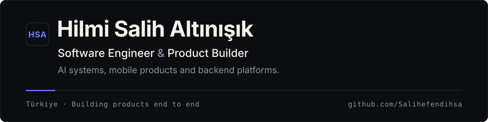
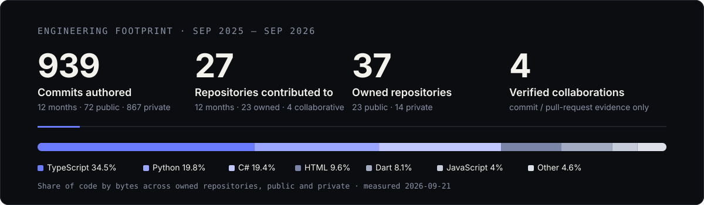
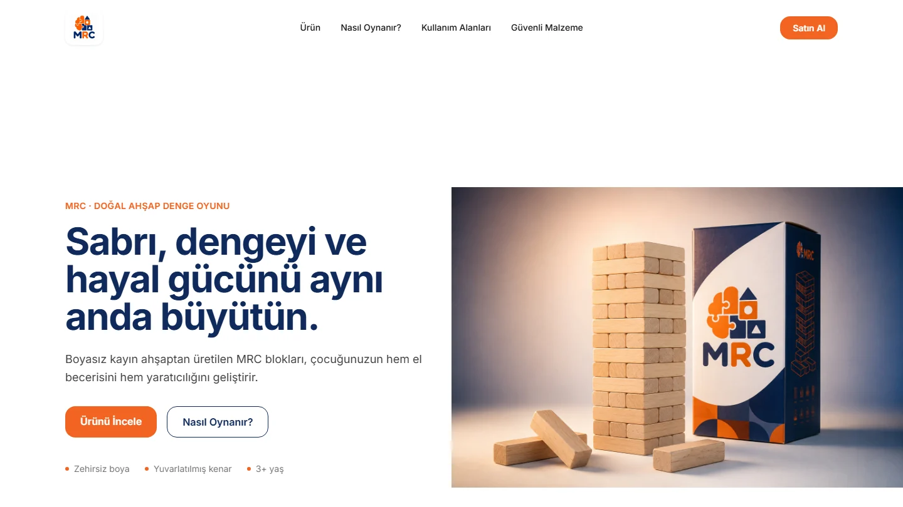
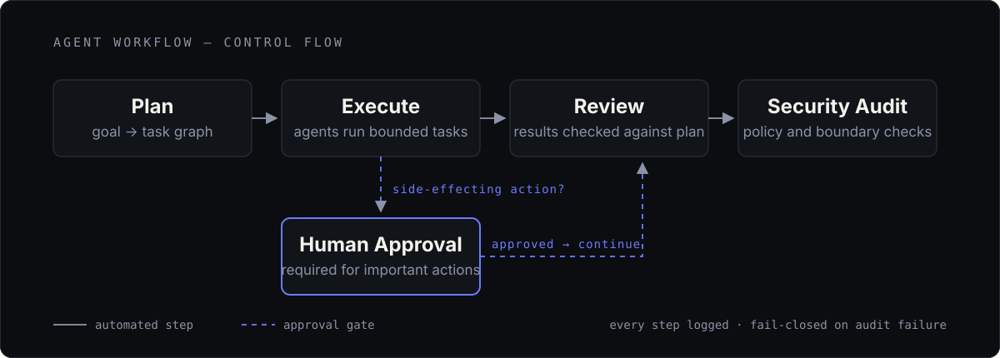

<picture>
  <source media="(prefers-color-scheme: dark)" srcset="assets/editorial/header-dark.svg">
  <source media="(prefers-color-scheme: light)" srcset="assets/editorial/header-light.svg">
  
</picture>

I build software products from architecture to launch — across backend, web and mobile.

Most of my current work is on AI-assisted systems, workflow automation and operational products for real businesses: a logistics marketplace, field-service and restaurant operations platforms, and multi-agent systems that keep humans in the approval loop.

Alongside engineering, I'm building a stronger product, sales and marketing perspective so the things I ship also find their market.

## Engineering Footprint

<picture>
  <source media="(prefers-color-scheme: dark)" srcset="assets/editorial/engineering-footprint-dark.svg">
  <source media="(prefers-color-scheme: light)" srcset="assets/editorial/engineering-footprint-light.svg">
  
</picture>

**939 authored commits** across accessible public and private repository default branches in the last 12 months (Sep 2025 – Sep 2026; 72 public, 867 private), spread over **27 repositories**, plus **37 owned repositories** and **4 verified collaborations**. Measured with the GitHub API on 2026-09-21 by matching the commit author to this account; this is a commit count, not GitHub's contribution count. Private-repository activity is included in this measurement, while GitHub's public contribution graph on this profile shows public activity only.

## Featured Work

### Navlonix

AI-assisted B2B logistics marketplace connecting shippers with verified drivers. Role-based apps for customers, drivers and operators, fair freight pricing, an escrow-style payment flow and real-time chat and tracking.

`.NET 9 · React · Expo · PostgreSQL / PostGIS` 
Founder & lead engineer · Private product · In active development

 

### MRC Commerce

A cinematic storefront for a wooden-toy brand: scroll-driven product experience, typed architecture and a migration-first database schema. The marketing experience is live; the commerce layer (cart, checkout, admin) is in progress.

`Next.js · TypeScript · Tailwind · Drizzle` 
[Repository](https://github.com/Salihefendihsa/mrc-commerce) · [Live](https://mrc-commerce.vercel.app)

 

### Multi-Agent AI Operations System

<picture>
  <source media="(prefers-color-scheme: dark)" srcset="assets/editorial/ai-systems-architecture-dark.svg">
  <source media="(prefers-color-scheme: light)" srcset="assets/editorial/ai-systems-architecture-light.svg">
  
</picture>

A general-purpose multi-agent operating layer with explicit security boundaries: agents plan and execute bounded tasks, results are reviewed and audited, and important actions wait for human approval. Reliability comes first — fault injection, fail-closed configuration and observability before autonomy is widened.

`Python · SQLite · Claude-based agents` 
Solo engineer · Private product · In active development

<!-- PROJECT_INDEX:START -->
<!-- Generated by scripts/generate_project_index.py: public repositories from the GitHub API + data/project_catalog.json. Do not edit by hand. -->

## Complete Project Portfolio

Public repositories are discovered automatically from GitHub; private and collaborative work is described from a public-safe catalog.

### Products & Platforms

| Project | What it does | Role · Access |
| --- | --- | --- |
| [MRC Commerce](https://github.com/Salihefendihsa/mrc-commerce) Featured · Building · [Live](https://mrc-commerce.vercel.app) Stack: Next.js · TypeScript · Tailwind · Drizzle | Cinematic, scroll-driven storefront for a wooden-toy brand; the marketing experience is live, the commerce layer is in progress. | Solo engineer Public |
| [Nalbur Stok](https://github.com/Salihefendihsa/nalbur-stok) Maintained Stack: React 19 · TypeScript · Vite · TanStack · Supabase | Inventory management for small hardware stores: virtualised 100K-row product tables, reports and a Supabase backend. | Solo engineer Public |

### AI & Automation

| Project | What it does | Role · Access |
| --- | --- | --- |
| [Shape Classifier](https://github.com/Salihefendihsa/ShapeClassifier) Maintained Stack: C# · .NET 8 · OpenCvSharp · ML.NET | Geometric shape recognition pipeline: synthetic data, OpenCV pre-processing, Hu-moment features and an ML.NET classifier. | Solo engineer Public |
| [AuraProject AI Service](https://github.com/Salihefendihsa/auraproject-ai-service) Experimental Stack: Python · FastAPI · OpenAI / Gemini · ControlNet | AI outfit-recommendation service with validation, auth and rate limiting, self-critique via a second LLM, wardrobe hashing and pose-locked virtual try-on. | Solo engineer Public |

### Backend & APIs

| Project | What it does | Role · Access |
| --- | --- | --- |
| [LLM Chatbot](https://github.com/Salihefendihsa/LLMChatbot) Maintained Stack: C# · .NET · REST | Streaming, multi-turn chatbot backend on the OpenAI-compatible Chat Completions API with a console client and tests. | Solo engineer Public |

### Desktop & Tools

| Project | What it does | Role · Access |
| --- | --- | --- |
| [Antivirus Simulator](https://github.com/Salihefendihsa/AntivirusSimulator) Coursework Stack: C# · WinForms | Educational antivirus simulator (signature scanning, async cancellation) built as an OOP course project; contains no real malware. | Student Public |
| [MultiLang Translator](https://github.com/Salihefendihsa/MultiLangTranslator) Maintained Stack: C# · .NET 8 · WPF · MVVM | WPF desktop app translating text into several languages in parallel, with auto-detection, caching, history and an offline mock provider. | Solo engineer Public |

## Private Products & Systems

Products built for real businesses or under NDA. Names and details are limited to what can be shared publicly; no private repositories are linked.

| Project | What it does | Role · Access |
| --- | --- | --- |
| **Navlonix** Featured · In active development Stack: .NET 9 · React · Expo · PostgreSQL / PostGIS | AI-assisted B2B logistics marketplace matching shippers with verified drivers: role-based apps, escrow-style payment flow, real-time chat and tracking. | Founder & lead engineer Private |
| **Multi-Agent AI Operations System** Featured · In active development Stack: Python · SQLite · Claude-based agents | General-purpose multi-agent operating layer with explicit security boundaries: bounded task execution, review and audit stages, human approval gates, fault injection and fail-closed reliability work. | Solo engineer Private |
| **Approval-First Social Media Operations Platform** In active development Stack: Python · FastAPI · PostgreSQL · Redis · Next.js · Docker | Multi-workspace backend for professional social accounts: secure Meta OAuth and webhooks, durable background jobs, AI-assisted inbox and comment workflows that never act without human approval. | Lead engineer Private |
| **Field Service Operations Platform** In active development Stack: TypeScript · Express · Prisma · Next.js | Internal management system for a pest-control service business: customers, staff, jobs, contracts, quotes and payments behind a typed API and an admin web panel. | Solo engineer Confidential |
| **Service Business Website & Panel** Delivered Stack: Next.js · TypeScript · Supabase | Marketing site with SEO, FAQ and service guides for a local service company, plus an authenticated panel and database schema. | Solo engineer Confidential |
| **Restaurant QR Ordering & POS** Delivered Stack: Next.js · TypeScript · Supabase Realtime | QR-based live table ordering for guests and a role-based admin POS: realtime order board, menu and table management, receipts and bill splitting, CI with unit tests. | Solo engineer Confidential |
| **Personal Finance & Investment Tracker** In development Stack: Flutter · Node.js · Express · MongoDB | Income and expense tracking, category budgets, FIFO profit/loss on gold and currency holdings, receipt and bank-statement OCR, reminders and cash-flow insights. Flutter client plus REST API. | Solo engineer Private |
| **AuraProject Core** Experimental Stack: Python · PyTorch · FastAPI · Streamlit | Private counterpart of the public AI service: PyTorch-based visual analysis, style-rule engine, weather and trend context for personalised outfit suggestions. | Solo engineer Private |

## Collaborative Work

Only repositories where my commits or pull requests are verifiable are listed. Ownership stays with the partner.

| Project | What it does | Role · Access |
| --- | --- | --- |
| **Sticker & Label Studio** Delivered Stack: TypeScript · React | Web app for designing school name stickers and labels: template library, positioned text editor, bulk generation from Excel/CSV and millimetre-accurate print layouts. | Lead contributor · 71 of 75 commits Collaborative · Private |
| **Couples Companion App** In development Stack: Flutter · Dart · Gradle / Kotlin toolchain | Flutter mobile app with shared goals, daily check-in nudges and a personality-informed character quiz; delivered through reviewed pull requests. | Core contributor · 37 commits, 30 pull requests Collaborative · Private |
| **Invitation Design Studio** Delivered Stack: React · Vite · JavaScript | Interactive web studio for wedding and event invitations: parses pasted invitation text, applies templates and phrase libraries, live preview and print preparation. | Primary contributor · 5 of 6 commits Collaborative · Private |
| **Product Photo Studio** In development Stack: Flutter · Dart · on-device ML | Flutter app that guides small sellers through 360° product capture, removes backgrounds fully on-device and exports social-ready posts. | Contributor · 2 of 7 commits Collaborative · Private |

## Academic & Experiments

University coursework, labs and small experiments (19)

| Project | What it does | Role · Access |
| --- | --- | --- |
| [Web Design Assignments](https://github.com/Salihefendihsa/web-tasarimi-odevler) Coursework Stack: JavaScript · HTML · CSS | Web design course assignments. | Student Public |
| [Functional Programming Lab 2](https://github.com/Salihefendihsa/Fonksiyonel-Programlama-LAB2) Coursework Stack: JavaScript · HTML · CSS | Functional programming lab: shared-wallet expense tracker for flatmates as a mobile web app. | Student Public |
| [Web Lab Hello](https://github.com/Salihefendihsa/web-lab-hello) Coursework Stack: React · TypeScript · Vite | Web lab starter: React + TypeScript + Vite setup. | Student Public |
| [Web Lab 1](https://github.com/Salihefendihsa/web-lab-1) Coursework Stack: HTML | Web lab exercise. | Student Public |
| [RSU JPEG Compression](https://github.com/Salihefendihsa/rsu-jpeg-compression) Experiment Stack: Python · NumPy · SciPy | Research experiment: a custom random-number generator drives dynamic JPEG quantization tables, benchmarked against the standard table. | Solo engineer Public |
| [Car Racing Game](https://github.com/Salihefendihsa/arabaYarisi) Coursework Stack: C# | Car-racing mini game written as a C# course project. | Student Public |
| [OOP Lab 6.2](https://github.com/Salihefendihsa/ntplabodev6.2) Coursework Stack: C# | Object-oriented programming lab assignment 6.2. | Student Public |
| [OOP Lab 6.1](https://github.com/Salihefendihsa/ntplabodevuygulama6.1) Coursework Stack: C# | Object-oriented programming lab application 6.1. | Student Public |
| [Minesweeper Clone](https://github.com/Salihefendihsa/mayinTarlasi) Coursework Stack: C# | Minesweeper clone written as a C# course project. | Student Public |
| [OOP Lab 5.1](https://github.com/Salihefendihsa/ntpLab5.1_Odev) Coursework Stack: C# | Object-oriented programming lab assignment 5.1. | Student Public |
| [OOP Lab 5](https://github.com/Salihefendihsa/netpLab5-Odev) Coursework Stack: C# | Object-oriented programming lab assignment 5. | Student Public |
| [Flappy Bird Clone](https://github.com/Salihefendihsa/proje2_flippybird) Coursework Stack: C# | Flappy-Bird style game written as a C# course project. | Student Public |
| [OOP Lab 2–3, 7–10](https://github.com/Salihefendihsa/ntp_lab_odev2-3-78910-) Coursework Stack: C# | Object-oriented programming lab assignments 2–3 and 7–10. | Student Public |
| [OOP Lab 2–3](https://github.com/Salihefendihsa/ntp_lab_odev2-3) Coursework Stack: C# | Object-oriented programming lab assignments 2–3. | Student Public |
| [OOP Lab](https://github.com/Salihefendihsa/NTP_Lab) Coursework Stack: C# | Object-oriented programming lab exercises. | Student Public |
| [Orientation Video](https://github.com/Salihefendihsa/oryantasyon) Coursework Stack: Video | Software-engineering orientation course video assignment. | Student Public |
| **OOP Lab — Tic-Tac-Toe** Coursework Stack: C# | Object-oriented programming lab exercise (2024). | Student Private |
| **OOP Lab — Week 4 exercise** Coursework Stack: C# | Object-oriented programming lab exercise (2024). | Student Private |
| **OOP Lab — Home desktop exercise** Coursework Stack: C# | Object-oriented programming lab exercise (2024). | Student Private |

Archived / earlier work (1)

| Project | What it does | Role · Access |
| --- | --- | --- |
| **Restaurant Order Desk & Reporting** Superseded Stack: React · Vite | Earlier single-page order desk for the same venue: table and takeaway cards, stock-aware menu, hourly and per-product sales reports. | Solo engineer Confidential |

<!-- PROJECT_INDEX:END -->

## Core Expertise

**Product Engineering** 
React, Next.js, TypeScript, product UX and end-to-end delivery.

**Backend Architecture** 
C#, .NET, Node.js, Python, PostgreSQL and API design.

**Mobile Applications** 
Flutter and React Native / Expo, backed by real APIs.

**AI Systems & Automation** 
Multi-agent workflows, approval gates, OpenAI, Gemini and Claude integrations, Docker-based deployment.

## Contact

[LinkedIn](https://www.linkedin.com/in/hilmi-salih-alt%C4%B1n%C4%B1%C5%9F%C4%B1k-6a9301294/) · [Email](mailto:altinisikhilmisalih@gmail.com) · [GitHub](https://github.com/Salihefendihsa)

If you're building something useful, I'd be glad to hear about it.
