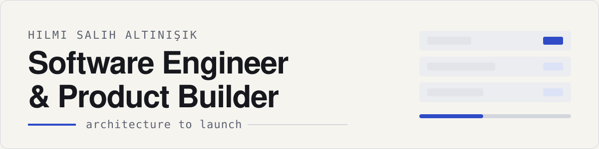
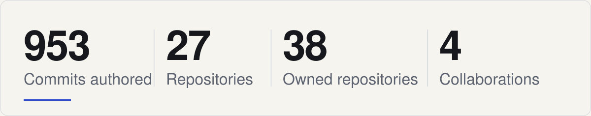
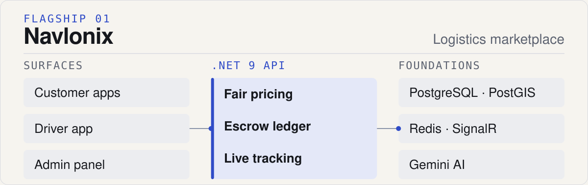
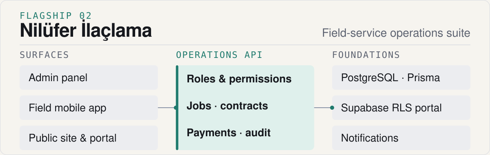
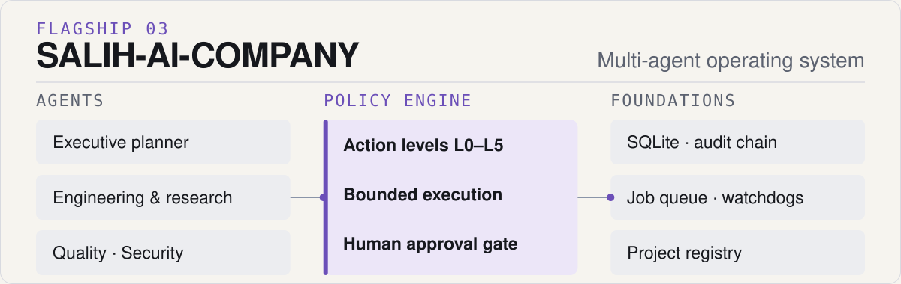

<picture>
  <source media="(prefers-color-scheme: dark)" srcset="assets/v5/hero-dark.svg">
  <source media="(prefers-color-scheme: light)" srcset="assets/v5/hero-light.svg">
  
</picture>

**Building operational software across logistics, field service, business automation and autonomous AI systems.**

I work from architecture to launch — backend, web and mobile — and combine engineering with product, sales and market thinking so the things I ship also find their market.

<picture>
  <source media="(prefers-color-scheme: dark)" srcset="assets/v5/proof-strip-dark.svg">
  <source media="(prefers-color-scheme: light)" srcset="assets/v5/proof-strip-light.svg">
  
</picture>

How these numbers are measured

 

- **953 commits authored** — commits on the default branches of every repository this account can access (owned and collaborator), Sep 2025 – Sep 2026, where the GitHub author login is this account. 76 are public, 877 private; 12 are pull-request merge commits I authored. This is an authored-commit count, not GitHub's contribution count — the public part (76) equals GitHub's public commit contributions for the same window.
- **27 repositories contributed to** in the same 12 months: 23 owned, 4 collaborative.
- **38 owned repositories** — 23 public, 15 private (including this profile repository).
- **4 verified collaborations** — partner-owned repositories with my commits or pull requests; access-only repositories with no verifiable contribution are not counted.
- **Code by language** across owned repositories, public and private: TypeScript 34.4 %, Python 19.7 %, C# 19.3 %, HTML 9.6 %, Dart 8.2 %, JavaScript 4.0 %, other 4.8 %.
- Measured with the GitHub API on 2026-09-21 by `scripts/discover_repositories.py`; the public contribution graph on this profile shows public activity only.

<!-- PORTFOLIO:START -->
<!-- Generated by scripts/generate_portfolio.py from data/portfolio.json + the public GitHub API. Do not edit by hand. -->

## Flagship Product Systems

### Navlonix

<picture>
  <source media="(prefers-color-scheme: dark)" srcset="assets/v5/flagship-navlonix-dark.svg">
  <source media="(prefers-color-scheme: light)" srcset="assets/v5/flagship-navlonix-light.svg">
  
</picture>

**AI-assisted B2B logistics marketplace that matches cargo owners with verified drivers.**

Industrial freight is still arranged over phone calls, negotiated prices and cash risk. Navlonix turns it into a marketplace: businesses post loads, verified drivers bid on an AI-computed fair base price, and the platform carries the job through escrow, live tracking and delivery confirmation.

- Role-based customer, driver and admin experiences on web and mobile
- Fair base-price engine from fuel prices, real road distance and vehicle type
- Escrow-style payment ledger with QR delivery confirmation and settlement preview
- Real-time offers, chat and location tracking; driver document verification with vision models

<b>Surfaces</b> .NET 9 API · Web app · Mobile app · Marketing site <b>Stack</b> .NET 9 · React · Expo · PostgreSQL / PostGIS · Redis · SignalR · Gemini Founder & lead engineer · In active development · Private product <i>Web app deployed for preview; payment-provider and regulatory integrations are on the roadmap, the ledger, matching and tracking flows run in code.</i>

### Nilüfer İlaçlama Operations Suite

<picture>
  <source media="(prefers-color-scheme: dark)" srcset="assets/v5/flagship-nilufer-ilaclama-dark.svg">
  <source media="(prefers-color-scheme: light)" srcset="assets/v5/flagship-nilufer-ilaclama-light.svg">
  
</picture>

**Field-service operations platform for a pest-control business — from customer records to field crews, contracts and payments.**

A pest-control company runs on scheduled jobs, crews in the field, recurring contracts and collections. The suite replaces scattered spreadsheets and phone calls with one operational system shared by the owner, managers, team leads, field staff and customers.

- Typed operations API with a role and permission model: owner, manager, team lead, staff, customer
- Admin web panel with a live command-centre dashboard, pending-approval queue and audit logs
- Field mobile app for jobs, calendar, approvals, leave and advance requests, messaging and payslips
- Customer records, service jobs and reports, contracts, quotations, payments — plus a public site with a row-level-secured customer portal

<b>Surfaces</b> Operations API · Admin web panel · Field mobile app · Public site & portal <b>Stack</b> TypeScript · Express · Prisma · PostgreSQL · Next.js · Flutter · Supabase Lead engineer · In active development · Client system · private

### SALIH-AI-COMPANY

<picture>
  <source media="(prefers-color-scheme: dark)" srcset="assets/v5/flagship-salih-ai-company-dark.svg">
  <source media="(prefers-color-scheme: light)" srcset="assets/v5/flagship-salih-ai-company-light.svg">
  
</picture>

**Autonomous multi-agent operating system that plans, executes and reviews bounded work under explicit human approval.**

Running several development projects with AI agents only makes sense if the agents cannot quietly take consequential actions. SALIH-AI-COMPANY is built as a reusable company operating system: agents do bounded work inside a deterministic policy engine, and everything that touches the outside world waits for the owner.

- Executive planner plus engineering, research, finance, quality and security agents with least-privilege scopes
- Deterministic policy engine with action levels L0–L5; external or irreversible actions need human approval
- Hash-chained audit trail, fail-closed reliability configuration, job queue with leases and dead-lettering, watchdogs and readiness gates
- Project registry that onboards external repositories through isolated worktrees; 500+ tests and smoke workflows

<b>Surfaces</b> Orchestrator · Department agents · Operations control plane · Reliability lab <b>Stack</b> Python 3.11 · SQLite · Claude-based agents Solo engineer · In active development · Private system <i>Scheduler and live network access stay switched off until the readiness gates pass; built for my own projects and team.</i>

## Selected Product Ecosystem

Products are grouped by what they do, not by repository: a backend, a client and a website of one product are one entry.

**Instagram AI Manager** · Approval-first Instagram operations platform for professional accounts. Multi-workspace backend where AI-assisted inbox, comment and publishing workflows pass through role checks, human approval and durable jobs before anything reaches the Meta API. Python · FastAPI · PostgreSQL · Redis · Next.js · Docker &nbsp;·&nbsp; Lead engineer &nbsp;·&nbsp; In active development · Private

**Finans Pro** · Personal finance and investment platform — mobile client plus REST API. Income and expense tracking, category budgets, FIFO profit and loss on gold and currency holdings, receipt and bank-statement OCR, subscriptions, debts, reminders and cash-flow insights. Flutter · Node.js · Express · MongoDB &nbsp;·&nbsp; Solo engineer &nbsp;·&nbsp; In development · Private

**Tatlı Durağı POS & QR Ordering** · QR table ordering and role-based admin POS for a dessert café. Guests order from a QR menu with live status; waiters, cashiers and managers run a realtime order board, receipts and bill splitting, menu and table management and a revenue dashboard. Next.js · TypeScript · Supabase Realtime &nbsp;·&nbsp; Solo engineer &nbsp;·&nbsp; Delivered · Client system · private

**[AuraProject](https://github.com/Salihefendihsa/auraproject-ai-service)** · AI outfit recommendation — a visual-analysis core and a hardened recommendation API. Public FastAPI service with validation, auth, rate limiting, second-LLM self-critique and pose-locked virtual try-on; private core with PyTorch visual analysis and a style-rule engine. Python · FastAPI · PyTorch · OpenAI / Gemini · ControlNet &nbsp;·&nbsp; Lead engineer &nbsp;·&nbsp; Experimental · Public service · private core

**[Nalbur Stok](https://github.com/Salihefendihsa/nalbur-stok)** · Inventory management for small hardware stores. Virtualised 100K-row product tables, reports and a Supabase backend. React 19 · TypeScript · Vite · TanStack · Supabase &nbsp;·&nbsp; Solo engineer &nbsp;·&nbsp; Maintained · Public

**Optivark** · Studio site for operational software — logistics, production, field teams and mobile tooling. Marketing site and solution catalogue for the software practice behind these products: logistics and dispatch, production optimisation, field-team mobile apps and barcode / QR tooling. React · TypeScript · Vite · GSAP &nbsp;·&nbsp; Solo engineer &nbsp;·&nbsp; In development · Private

## Selected Collaborations

Partner-owned products where my commits or pull requests are verifiable. Ownership stays with the partner; no private repositories are linked.

**Sticker & Label Studio** · Web studio for school name stickers and labels. Template library, positioned text editor, bulk generation from Excel and CSV, millimetre-accurate print layouts and Word export. Next.js · TypeScript · Supabase · Cloudflare &nbsp;·&nbsp; Built in collaboration · Lead contributor · 71 of 75 commits &nbsp;·&nbsp; Delivered · Partner-owned · private

**Couples Companion App** · Flutter app that helps couples share how they feel without a fight. Emotion signals, shared goals, daily check-in nudges, a character quiz and weekly insights, delivered through reviewed pull requests with accessibility tests. Flutter · Dart · Supabase &nbsp;·&nbsp; Built in collaboration · Core contributor · 37 commits · 36 pull requests &nbsp;·&nbsp; In development · Partner-owned · private

**Invitation Design Studio** · Interactive studio for wedding and event invitations. Parses pasted invitation text into fields, applies templates and phrase libraries, previews live and exports print-ready Word documents. React · Vite · JavaScript &nbsp;·&nbsp; Built in collaboration · Lead contributor · 5 of 6 commits &nbsp;·&nbsp; Delivered · Partner-owned · private

**Product Photo Studio** · Flutter app that turns product photos into social-ready posts. Guided 360° capture, fully on-device background removal, studio backgrounds and post, carousel and story export for small sellers. Flutter · Dart · on-device ML · Supabase &nbsp;·&nbsp; Built in collaboration · Contributor · 2 of 7 commits &nbsp;·&nbsp; In development · Partner-owned · private

<!-- PORTFOLIO:END -->

## Engineering Approach

- **Architecture before scale** — modular monoliths with clear seams; every product above started as one deployable with typed boundaries.
- **Typed boundaries, testable workflows** — validation at the edges, unit tests and CI on anything that runs for other people.
- **Human approval for consequential AI actions** — a message, a payment or a deployment waits for a person; agents propose, people decide.
- **Security and observability before autonomy** — fail-closed configuration, audit trails and readiness gates come before unattended runs.
- **Usefulness over technology theatre** — the stack is chosen per product by what the business needs to run.

<!-- ARCHIVE:START -->
<!-- Generated by scripts/generate_portfolio.py from data/portfolio.json + the public GitHub API. Do not edit by hand. -->

## Complete Project Archive

Everything else that is safe to show: public repositories discovered automatically from GitHub, plus allowlisted private work under generic names. Products above are not repeated here.

<b>Tools &amp; Research</b> (4)

| Project | What it does |
| --- | --- |
| [LLM Chatbot](https://github.com/Salihefendihsa/LLMChatbot) C\# · .NET · Public | Streaming, multi-turn chatbot backend on the OpenAI-compatible Chat Completions API with a console client and tests. |
| [MultiLang Translator](https://github.com/Salihefendihsa/MultiLangTranslator) C\# · .NET 8 · WPF · MVVM · Public | WPF desktop app translating text into several languages in parallel, with auto-detection, caching, history and an offline mock provider. |
| [RSU JPEG Compression](https://github.com/Salihefendihsa/rsu-jpeg-compression) Python · NumPy · SciPy · Public | Research experiment: a custom random-number generator drives dynamic JPEG quantization tables, benchmarked against the standard table. |
| [Shape Classifier](https://github.com/Salihefendihsa/ShapeClassifier) C\# · .NET 8 · OpenCvSharp · ML.NET · Public | Geometric shape recognition: synthetic data, OpenCV pre-processing, Hu-moment features and an ML.NET classifier. |

<b>University Coursework</b> (18)

| Project | What it does |
| --- | --- |
| [Antivirus Simulator](https://github.com/Salihefendihsa/AntivirusSimulator) C\# · WinForms · Public | Educational antivirus simulator (signature scanning, async cancellation) built as an OOP course project; contains no real malware. |
| [Car Racing Game](https://github.com/Salihefendihsa/arabaYarisi) C\# · Public | Car-racing mini game written as a C\# course project. |
| [Flappy Bird Clone](https://github.com/Salihefendihsa/proje2_flippybird) C\# · Public | Flappy-Bird style game written as a C\# course project. |
| [Functional Programming Lab 2](https://github.com/Salihefendihsa/Fonksiyonel-Programlama-LAB2) JavaScript · HTML · CSS · Public | Shared-wallet expense tracker for flatmates as a mobile web app. |
| [Minesweeper Clone](https://github.com/Salihefendihsa/mayinTarlasi) C\# · Public | Minesweeper clone written as a C\# course project. |
| [OOP Lab](https://github.com/Salihefendihsa/NTP_Lab) C\# · Public | Object-oriented programming lab exercises. |
| [OOP Lab 2–3](https://github.com/Salihefendihsa/ntp_lab_odev2-3) C\# · Public | Object-oriented programming lab assignments 2–3. |
| [OOP Lab 2–3, 7–10](https://github.com/Salihefendihsa/ntp_lab_odev2-3-78910-) C\# · Public | Object-oriented programming lab assignments 2–3 and 7–10. |
| [OOP Lab 5](https://github.com/Salihefendihsa/netpLab5-Odev) C\# · Public | Object-oriented programming lab assignment 5. |
| [OOP Lab 5.1](https://github.com/Salihefendihsa/ntpLab5.1_Odev) C\# · Public | Object-oriented programming lab assignment 5.1. |
| [OOP Lab 6.1](https://github.com/Salihefendihsa/ntplabodevuygulama6.1) C\# · Public | Object-oriented programming lab application 6.1. |
| [OOP Lab 6.2](https://github.com/Salihefendihsa/ntplabodev6.2) C\# · Public | Object-oriented programming lab assignment 6.2. |
| **OOP Lab — Home desktop exercise** C\# · Private | Object-oriented programming lab exercise (2024). |
| **OOP Lab — Tic-Tac-Toe** C\# · Private | Object-oriented programming lab exercise (2024). |
| **OOP Lab — Week 4 exercise** C\# · Private | Object-oriented programming lab exercise (2024). |
| [Orientation Video](https://github.com/Salihefendihsa/oryantasyon) Video · Public | Software-engineering orientation course video assignment. |
| [Web Design Assignments](https://github.com/Salihefendihsa/web-tasarimi-odevler) JavaScript · HTML · CSS · Public | Web design course assignments. |
| [Web Lab Hello](https://github.com/Salihefendihsa/web-lab-hello) React · TypeScript · Vite · Public | Web lab starter: React + TypeScript + Vite setup. |

<!-- ARCHIVE:END -->

## Contact

[LinkedIn](https://www.linkedin.com/in/hilmi-salih-alt%C4%B1n%C4%B1%C5%9F%C4%B1k-6a9301294/) · [Email](mailto:altinisikhilmisalih@gmail.com) · [GitHub](https://github.com/Salihefendihsa)

If you are building something useful, I would be glad to hear about it.
