  

## Building Beyond the Code

I engineer products across AI, automation, backend and mobile — and I measure them by the business problems they actually solve. My work runs from multi-agent systems and workflow automation to .NET and Node APIs, React and Flutter apps.

A product isn't done when the code compiles. I design it, validate it against real users, ship it in controlled steps and keep learning on the sales and marketing side so the next release lands better than the last.

## My Product Operating System

  

## Flagship Product

  

**Navlonix** is an AI-powered logistics marketplace that matches businesses with verified drivers in seconds. Role-based apps for customers, drivers and operators; escrow-backed payments; real-time chat and live tracking. Architected and built solo on .NET 9, React, Expo and PostgreSQL — currently in active development.

→ [Open the live demo](https://yuk-le.vercel.app)

## From the Lab

  

Private R&D on multi-agent orchestration: agents plan and act inside explicit boundaries, humans approve what matters, and every workflow stays observable and fail-closed. Python, FastAPI, OpenAI and Gemini APIs, Docker.

 

  

A cinematic, scroll-driven brand storefront with a production-grade marketing experience and a migration-first typed schema. Cart, checkout and admin are the next phases. Next.js, TypeScript, Tailwind, Drizzle.

→ [Repository](https://github.com/Salihefendihsa/mrc-commerce) · [Live demo](https://mrc-commerce.vercel.app)

## Core Stack

  

Also in the toolbox: ASP.NET Core · Express · FastAPI · React Native / Expo · Vite · Tailwind CSS · Supabase · Prisma · Drizzle · MongoDB · ML.NET · OpenCV · OpenAI API · Gemini API

## Current Signal

  

## Build With Me

  &nbsp;
  &nbsp;
  

  

