<div align="center">



</div>

## Welcome to My Workshop

**I build software where AI, automation, and real business needs meet.**

I take products end-to-end — from architecture and backend to mobile apps and shipped UI — and I'm increasingly focused on AI agent systems and workflow automation. Along the way I keep a product and business lens on every build: what it's for, who it serves, and how it grows.

## Inside the Workshop



## Selected Builds

<a href="https://yuk-le.vercel.app"></a>

<sub>**Navlonix** · AI-powered logistics marketplace matching shippers with trusted drivers — role-based apps, escrow-backed payments, real-time chat and tracking. Built solo on .NET 9, React, Expo and PostgreSQL. In active development. → [Live demo](https://yuk-le.vercel.app)</sub>

<br/>



<sub>**AI & Autonomous Systems** · Private R&D on multi-agent orchestration: agents plan and act inside explicit boundaries, humans approve what matters, and every workflow stays observable. Python, FastAPI, OpenAI and Gemini APIs, Docker.</sub>

<br/>

<a href="https://github.com/Salihefendihsa/mrc-commerce"></a>

<sub>**MRC Commerce** · Cinematic, scroll-driven brand storefront with a production-grade marketing experience. The typed database schema is in place; cart, checkout and admin are the next phases. Next.js, TypeScript, Tailwind, Drizzle. → [Repository](https://github.com/Salihefendihsa/mrc-commerce) · [Live demo](https://mrc-commerce.vercel.app)</sub>

## Tech Universe



## Workshop Status

```text
┌─ WORKSHOP STATUS ──────────────────────────────────────┐
│                                                        │
│  MODE      Building                                    │
│  FOCUS     AI × Products × Automation                  │
│  BASE      Türkiye                                     │
│  SIGNAL    Open to meaningful collaborations           │
│                                                        │
└────────────────────────────────────────────────────────┘
```

## Activity

<div align="center">


</div>

## Contact

<div align="center">

<a href="https://www.linkedin.com/in/hilmi-salih-alt%C4%B1n%C4%B1%C5%9F%C4%B1k-6a9301294/"></a>
&nbsp;
<a href="mailto:altinisikhilmisalih@gmail.com"></a>
&nbsp;
<a href="https://github.com/Salihefendihsa"></a>

</div>


